# learn-javascript-arithmetic

### ```数组```
        
>1 ,求斐波那契额数列的前20个数字 已知斐波那契额数列中的第一个数字是1 第二个是二 ，从第三项开始，每一项都等于前两项之和:

```javascript 
let fibonacci = []; 
fibonacci [0] = 1;
fibonacci [1] = 2;
for(let i = 2;i<=20;i++){
    fibonacci[i] = fibonacci[i-2]+fibonacci[i-1];
}
console.log(fibonacci);
//[1, 2, 3, 5, 8, 13, 21, 34, 55, 89, 144, 233, 377, 610, 987, 1597, 2584, 4181, 6765, 10946, 17711]
```
> 输入索引返回对应的值 

```javascript
//解法一 
function fibonacci(index){
    if(index===1||index===2){
        return 1;
    }
    return fibonacci(index-2)+fibonacci(index-1);
}
console.log(fibonacci(7));
//13
```

```javascript
//利用数组缓存进行优化
let fibonacci = function() {
    let temp = [0, 1];
    return function(n) {
        let result = temp[n];
        if(typeof result != 'number') {
            result = fibonacci(n - 1) + fibonacci(n - 2);
            temp[n] = result; // 将每次 fibonacci(n) 的值都缓存下来
        }
        return result;
    }
}(); 
```

```javascript
//动态规划
function fibonacci(n) {
    let current = 0;
    let next = 1;
    let temp;
    for(let i = 0; i < n; i++) {
        temp = current;
        current = next;
        next += temp;
    }
    console.log(`fibonacci(${n}, ${next}, ${current + next})`);
    return current;
}
```
### ```矩阵```
>二维和多维数组

* 创建一个矩阵
 ```javascript
    var averageTemp = [];
    //day 1
    averageTemp[0] = [];
    averageTemp[0][0] = 72;
    averageTemp[0][1] = 75;
    averageTemp[0][2] = 79;
    averageTemp[0][3] = 79;
    averageTemp[0][4] = 81;
    averageTemp[0][5] = 81;
    //day 2
    averageTemp[1] = [];
    averageTemp[1][0] = 81;
    averageTemp[1][1] = 79;
    averageTemp[1][2] = 75;
    averageTemp[1][3] = 75;
    averageTemp[1][4] = 73;
    averageTemp[1][5] = 72;
 ```
        
>输出矩阵内容具体方法
```js
function printMatrix(myMatrix) {
    for (var i=0; i<myMatrix.length; i++){
        for (var j=0; j<myMatrix[i].length; j++){
            console.log(myMatrix[i][j]);
        } 
    }
}
printMatrix(averageTemp);
```
>假如我们要创建一个3×3的矩阵，每一格里 包含矩阵的i(行)、j(列)及z(深度)之和:
```js
 var matrix3x3x3 = [];
    for (var i=0; i<3; i++){
        matrix3x3x3[i] = [];
        for (var j=0; j<3; j++){ 
            matrix3x3x3[i][j] = [];
            for (var z=0; z<3; z++){
                matrix3x3x3[i][j][z] = i+j+z;
            }
        }
    }
    //输出矩阵内容 
    for (var i=0; i<matrix3x3x3.length; i++){
        for (var j=0; j<matrix3x3x3[i].length; j++){
            for (var z=0; z<matrix3x3x3[i][j].length; z++){
                console.log(matrix3x3x3[i][j][z]);
            } 
        }
    }
```
               
>sort 对象类型的数组 排序
```js
var friends = [
    {name: 'John', age: 30},
    {name: 'Ana', age: 20},
    {name: 'Chris', age: 25}
];
friends.sort((a,b)=>a.age-b.age)
```
        
> 2. 字符串排序
```js
var names =['Ana', 'ana', 'john', 'John'];
console.log(names.sort()); 

//["Ana", "John", "ana", "john"]

//JavaScript在做字符比较 的时候，是根据字符对应的ASCII值来比较的。例如，A、J、a、j对应的ASCII值分别是65、75、 7、106。
//虽然在字母表里a是最靠前的，但J的ASCII值比a的小，所以排在a前面
```
         
### ```栈```
>栈是一种遵从后进先出(LIFO)原则的有序集合。新添加的或待删除的元素都保存在栈的 末尾，称作栈顶，另一端就叫栈底。在栈里，新元素都靠近栈顶，旧元素都接近栈底。
```js
function Stack() {
    var items = [];
    this.push = function(element){
        items.push(element);
    };
    this.pop = function(){
        return items.pop();
    };
    this.peek = function(){
        return items[items.length-1];
    };
    this.isEmpty = function(){
        return items.length == 0;
    };
    this.size = function(){
        return items.length;
    };
    this.clear = function(){
        items = [];
    };
    this.print = function(){
        console.log(items.toString());
    }
}
```
        
>要把十进制转化成二进制，我们可以将该十进制数字和2整除(二进制是满二进一)，直到结 果是0为止。举个例子，把十进制的数字10转化成二进制的数字，过程大概是这样:
```js
function divideBy2(decNumber){
    var remStack = new Stack(),
        rem,
        binaryString = '';
    while (decNumber > 0){ 
        rem = Math.floor(decNumber % 2);
        remStack.push(rem); 
        decNumber = Math.floor(decNumber / 2); 
    }
    while (!remStack.isEmpty()){ 
        binaryString += remStack.pop().toString();
    }
    return binaryString;
}
console.log(divideBy2(10));  //1010
console.log(divideBy2(100));  //1100100
```

```js
//把数字转成任何进制
function baseConverter(decNumber,baseNumber){
    var remStack = new Stack(),
    rem,
    baseDtring="",
    digits = "0123456789ABCDEF";
    while(decNumber>0){
        rem = Math.floor(decNumber%baseNumber);
        remStack.push(rem);
        decNumber = Math.floor(decNumber/baseNumber);
    }
    while(!remStack.isEmpty()){
        baseDtring += digits[remStack.pop()]
    }
    return baseDtring;
}
console.log(baseConverter(100,2));  //1100100
```  

### ```队列```

>队列是遵循FIFO(First In First Out，先进先出，也称为先来先服务)原则的一组有序的项。 队列在尾部添加新元素，并从顶部移除元素。最新添加的元素必须排在队列的末尾。

```js
function Queue(){

    let items = [];

    this.enqueue = function(element){
        items.push(element);
    };

    this.dequeue = function(){
        return items.shift();
    }
    
    this.front = function(){
        return items[0];
    }

    this.isEmpty = function(){
        return items.length===0;
    }

    this.clear = function(){
        items.length = 0;
    }

    this.size = function(){
        return items.length;
    }

    this.print = function(){
        console.log(items.toString());
    }
}

var queue = new Queue(); 
console.log(queue.isEmpty());
queue.enqueue("John");
queue.enqueue("Jack");
queue.enqueue("Camila");
queue.print(); 
console.log(queue.size()); //输出3 
console.log(queue.isEmpty()); //输出false
queue.dequeue();
queue.dequeue();
queue.print();

```

### ```优先队列```
队列大量应用在计算机科学以及我们的生活中，我们在之前话题中实现的默认队列也有一些
修改版本。
其中一个修改版就是优先队列。元素的添加和移除是基于优先级的。一个现实的例子就是机 场登机的顺序。头等舱和商务舱乘客的优先级要高于经济舱乘客。在有些国家，老年人和孕妇(或 带小孩的妇女)登机时也享有高于其他乘客的优先级。
另一个现实中的例子是医院的(急诊科)候诊室。医生会优先处理病情比较严重的患者。通 常，护士会鉴别分类，根据患者病情的严重程度放号。
实现一个优先队列，有两种选项:设置优先级，然后在正确的位置添加元素;或者用入列操 作添加元素，然后按照优先级移除它们。在这个示例中，我们将会在正确的位置添加元素，因此 可以对它们使用默认的出列操作:

```js

function PriorityQueue(){

    let items = [];

    function QueueElement(element,priority){
        this.element = element;
        this.priority = priority;
    }

    this.enqueue = function(element, priority){
        let queueElement =  new QueueElement(element, priority);
        if(this.isEmpty()){
            items.push(queueElement)
        }else{
            let added = false;
            for(let i = 0;i<items.length;i++){
                if(queueElement.priority<items[i].priority){
                    items.splice(i,0,queueElement);
                    added = true;
                    break;
                }
            }
            if(!added){
                items.push(queueElement);
            }
        }
    }
    this.dequeue = function(){
        return items.shift();
    }
    
    this.front = function(){
        return items[0];
    }

    this.isEmpty = function(){
        return items.length===0;
    }

    this.clear = function(){
        items.length = 0;
    }

    this.size = function(){
        return items.length;
    }

    this.print = function(){
        console.log(JSON.stringify(items));
    }
}

var priorityQueue = new PriorityQueue();

priorityQueue.enqueue("John", 2);
priorityQueue.enqueue("Jack", 1);
priorityQueue.enqueue("Camila", 1);

priorityQueue.print();
console.log(priorityQueue.size());

```
我们在这里实现的优先队列称为 ```最小优先队列``` ，因为优先级的值较小的元素被放置在队列最 前面(1代表更高的优先级)。最大优先队列则与之相反，把优先级的值较大的元素放置在队列最 前面。

### ``` 循环队列——击鼓传花 ```

还有另一个修改版的队列实现，就是循环队列。循环队列的一个例子就是击鼓传花游戏(Hot Potato)。在这个游戏中，孩子们围成一个圆圈，把花尽快地传递给旁边的人。某一时刻传花停止， 这个时候花在谁手里，谁就退出圆圈结束游戏。重复这个过程，直到只剩一个孩子(胜者)。

```js

function hotPotato(nameList,number){
    let queue = new Queue();
    let length = nameList.length;
    for(let i=0;i<length;i++){
        queue.enqueue(nameList[i]);
    }
    let eliminated = "";
    while(queue.size()>1){
        for(let j=0;j<number;j++){
            queue.enqueue(queue.dequeue());
        }
        eliminated = queue.dequeue();
        console.log(eliminated + '在击鼓传花游戏中被淘汰。');
    }
    return queue.dequeue();
}

var names = ['John','Jack','Camila','Ingrid','Carl']; 
var winner = hotPotato(names, 7); 
console.log('胜利者:' + winner);
```
>以上算法的输出如下:

```json
    Camila在击鼓传花游戏中被淘汰。 
    Jack在击鼓传花游戏中被淘汰。
    Carl在击鼓传花游戏中被淘汰。 
    Ingrid在击鼓传花游戏中被淘汰。 
    胜利者:John
```

### 链表
要存储多个元素，数组(或列表)可能是最常用的数据结构。正如之前提到过的，每种 语言都实现了数组。这种数据结构非常方便，提供了一个便利的[]语法来访问它的元素。然而， 这种数据结构有一个缺点:(在大多数语言中)数组的大小是固定的，从数组的起点或中间插入 或移除项的成本很高，因为需要移动元素( 尽管我们已经学过的JavaScript的Array类方法可以帮 我们做这些事，但背后的情况同样是这样 )
<br/>
链表存储有序的元素集合，但不同于数组，``` 链表中的元素在内存中并不是连续放置的。每个 元素由一个存储元素本身的节点和一个指向下一个元素的引用(也称指针或链接)组成```。下图展 示了一个链表的结构:


相对于传统的数组，链表的一个好处在于，添加或移除元素的时候不需要移动其他元素。然 而，链表需要使用指针，因此实现链表时需要额外注意。数组的另一个细节是可以直接访问任何 位置的任何元素，而要想访问链表中间的一个元素，需要从起点(表头)开始迭代列表直到找到 所需的元素。
<br/>
<br/>

以火车为例，一列火车是由一系列车厢(也 称车皮)组成的。每节车厢或车皮都相互连接。你很容易分离一节车皮，改变它的位置，添加或 移除它。下图演示了一列火车。每节车皮都是列表的元素，车皮间的连接就是指针


理解了链表是什么之后，现在就要开始实现我们的数据结构了。以下是我们的```LinkedList``` 类的骨架

```js
function LinkedList() {
        var Node = function(element){ 
            this.element = element;
            this.next = null;
        };
        var length = 0; 
        var head = null; 
        this.append = function(element){};
        this.insert = function(position, element){};
        this.removeAt = function(position){};
        this.remove = function(element){};
        this.indexOf = function(element){};
        this.isEmpty = function() {};
        this.size = function() {};
        this.toString = function(){};
        this.print = function(){};
}
```
| 方法 | 详情 |
|--|--|
| append(element)|向列表尾部添加一个新的项|
|insert(position, element)|向列表的特定位置插入一个新的项。|
|remove(element)|从列表中移除一项。|
|indexOf(element)|返回元素在列表中的索引。如果列表中没有该元素则返回-1|。
|removeAt(position)|从列表的特定位置移除一项。|
|isEmpty()|如果链表中不包含任何元素，返回true，如果链表长度大于0则返回false。 |
|size()|返回链表包含的元素个数。与数组的length属性类似。 toString():由于列表项使用了Node类，就需要重写继承自JavaScript对象默认的|
|toString方法|让其只输出元素的值。|

>向链表尾部追加元素

向LinkedList对象尾部添加一个元素时，可能有两种场景:列表为空，添加的是第一个元 素，或者列表不为空，向其追加元素。
```js
this.append = function(element){
        var node = new Node(element),
            current; 
        if (head === null){ 
            //列表中第一个节点 
            head = node;
        } else {
            current = head; 
                //循环列表，直到找到最后一项 while(current.next){
                current = current.next;
            }
            //找到最后一项，将其next赋为node，建立链接
            current.next = node;
        }
        //更新列表的长度 
        length++; 
};
```
>从链表中移除元素

```js
this.removeAt = function(position){
    //检查越界值
    if (position > -1 && position < length){ 
        var current = head, 
            previous, 
            index = 0; 
        //移除第一项
        if (position === 0){ 
            head = current.next;
        } else {
            while (index++ < position){ 
                previous = current;     
                current = current.next; 
            }
            //将previous与current的下一项链接起来:跳过current，从而移除它
            previous.next = current.next; 
        }
        length--; 
        return current.element;
    } else {
            return null; 
    } 
};
```
>在任意位置插入一个元素

```js
this.insert = function(position, element){
    //检查越界值
    if (position >= 0 && position <= length){ 
            var node = new Node(element),
                current = head,
                previous,
                index = 0;
            if (position === 0){ //在第一个位置添加 node.next =         current; 
                head = node;
            } else {
                while (index++ < position){
                    previous = current;
                    current = current.next;
                }
                node.next = current; 
                previous.next = node; 
            }
            length++; //更新列表的长度
            return true;
        } else {
            return false; //{6}
        }
};
```
>完整实现
```js
function LinkedList(){
    let Node = function(element){
        this.element = element;
        this.next = null;
    }
    let length = 0;
    let head = null;  // 保存第一个元素的引用
    this.append = function(element){
        let node = new Node(element);
        let current;
        if(head==null){
            head = node;
        }else{
            current = head;
            // 以head 为起点查找最后一个next属性不为空的节点
            while(current.next){
                current = current.next;
            }
            // 把当前创建的节点添加到尾部
            current.next = node;
        }
        length++;
    };
    this.insert = function(position,element){
        if(position>-1&&position<length){
            let node = new Node(element);
            let current = head;
            let index=0;
            let previous;
            if(position===0){
                node.next = current;
                head = node;
            }else{
                // 查找到 position 对应节点上一个和下一个值
                while (index++ < position){ 
                    previous = current;
                    current = current.next;
                }
                previous.next = node;
                node.next = current;
            }
            length++;
            return true;
        }else{
            return false;
        }
    };
    this.removeAt = function(position){
        //检查越界值
        if (position > -1 && position < length){
            var current = head,
                previous, 
                index = 0; 
            
            if (position === 0){ 
                //如果要删除的是第一个元素就让 head 指向current的next 
                head = current.next; 
            } else {
                while (index ++ < position){ 
                    previous = current;    
                    current = current.next; 
                }
                // 连接指定位置的上一个元素和下一个元素
                previous.next = current.next; // {9}
            }
            length--; // {10}
            return current.element;
        } else {
            return null; // {11}
        } 
    }
    this.remove = function(element){
        let index = this.indexOf(element);
        return this.removeAt(index);
    };
    this.indexOf = function(element){
        let current = head;
        let index = -1;
        while(current){
            if(current.element = element){
                return index; 
            }
            index++;
            current = current.next;
        }
        return index;
    };
    this.isEmpty = function(){
        return length == 0;
    };
    this.size = function() {
        return length;
    };
    this.toString = function(){
        let current = head;
        let string = '';
        while(current){
            string+=current.element;
            current = current.next;
        }
        return string;
    };
    this.print = function(){};
    this.getHead= function(){
        return head;
    }
}
```
### 双向链表

双向链表和普通链表的区别在于，在链表中， 一个节点只有链向下一个节点的链接，而在双向链表中，链接是双向的:一个链向下一个元素， 另一个链向前一个元素，如下图所示。


双向链表提供了两种迭代列表的方法:从头到尾，或者反过来。我们也可以访问一个特定节 点的下一个或前一个元素。在单向链表中，如果迭代列表时错过了要找的元素，就需要回到列表 起点，重新开始迭代。这是双向链表的一个优点。

### 循环链表 
循环链表可以像链表一样只有单向引用，也可以像双向链表一样有双向引用。循环链表和链 表之间唯一的区别在于，最后一个元素指向下一个元素的指针(tail.next)不是引用null， 而是指向第一个元素(head), 如下图所示 


双向循环链表有指向head元素的tail.next，和指向tail元素的head.prev


# 集合
集合是由一组无序且唯一(即不能重复)的项组成的。这个数据结构使用了与有限集合相同 的数学概念，但应用在计算机科学的数据结构中。在数学中，集合也有并集、交集、差集等基本操作.

我们要实现的类就是以ECMAScript 6中Set类的实现为基础的

有一个非常重要的细节，我们使用对象而不是数组来表示集合(items)。但也可以用数组 实现。在这里我们用对象来实现，稍微有点儿不一样，也学习一下实现相似数据结构的新方法。 同时，JavaScript的对象不允许一个键指向两个不同的属性，也保证了集合里的元素都是唯一的

接下来，需要声明一些集合可用的方法(我们会尝试模拟与ECMAScript 6实现相同的Set类

|方法|详情|
|-|-|
 add(value)|向集合添加一个新的项。
|remove(value)|从集合移除一个值。|
|has(value)|如果值在集合中，返回true，否则返回false。|
|clear()|移除集合中的所有项。|
|size()|返回集合所包含元素的数量。与数组的length属性类似|
|values()|返回一个包含集合中所有值的数组。|

> 具体代码

```js
function Set(){
    let items = {};
    this.has = function(value){
        return items.hasOwnProperty(value);
    }
    this.remove = function(value){
        if(this.has(value)){
            delete items[value];
            return true;
        }
        return false;
    }
    this.clear = function(){
        items = {};
    }
    this.add = function(value){
        if(!this.has(value)){
            items[value] = value;
            return true
        }
        return false;
    }
    this.size = function(){
        return Object.keys(items).length;
    }
    this.values = function(){
        let keys = [];
        for(let key in items){
            keys.push(key); 
        }
        return keys;
    }
    //并集 
    this.union = function(otherSet){
        let unionSet = new Set();

        let currentValues = this.values();
        for(let i in currentValues){
            unionSet.add(currentValues[i])
        }

        let otherValues =  otherSet.values();
        for(let j in otherValues){
            unionSet.add(otherValues[j])
        }

        return unionSet;
    }
    // 交集
    this.intersection = function(others){
        let values = this.values();
        let intersection = new Set();
        for(let key in values){
            if(others.has(key)){
                intersection.add(key)
            }
        }
        return intersection;
    }
    //差集
    this.difference = function(otherSet){
        let difference = this.values();
        let differenceSet = new Set();
        for(let key in values){
            if(!others.has(key)){
                differenceSet.add(key)
            }
        }
        return differenceSet;
    }
    this.subset = function(otherSet){
        if (this.size() > otherSet.size()){ 
            return false;
        } else {
            var values = this.values();
            for (var i=0; i<values.length; i++){ 
                if (!otherSet.has(values[i])){ 
                    return false; 
                } 
            }
            return true; 
        }
    }
}

```

# 字典和散列表
### ```字典```
集合、字典和散列表可以存储不重复的值。在集合中，我们感兴趣的是每个值本身，并把它 当作主要元素。在字典中，我们用[键，值]的形式来存储数据。在散列表中也是一样(也是以[键， 值]对的形式来存储数据)。但是两种数据结构的实现方式略有不同，本章中将会介绍。

我们在本章中将要实现的类就是以ECMAScript 6中Map类的实现为基础的。你会发现它和 类很相似(但不同于存储[值，值]对的形式，我们将要存储的是[键，值]对)。

创建一个字典 他有如下方法
|方法|详情|
|-|-|
|set(key,value)|向字典中添加新元素。|
|remove(key)|通过使用键值来从字典中移除键值对应的数据值。|
|has(key)|如果某个键值存在于这个字典中，则返回true，反之则返回false。||get(key)|通过键值查找特定的数值并返回。|
|clear()|将这个字典中的所有元素全部删除。|
|size()|返回字典所包含元素的数量。与数组的length属性类似。|
|keys()|将字典所包含的所有键名以数组形式返回。|
|values()|将字典所包含的所有数值以数组形式返回。|

代码 
```js
function Dictionary(){

    let items = {};

    this.has = function(key){
        return key in items;
    };

    this.get = function(key){
        return this.has(key)?items[key]:undefined;
    };

    this.set = function(key,value){
        items[key] = value;
    }

    this.remove = function(key){
        if(this.has(key)){
            delete items[key];
            return true;
        }
        return false;
    }

    this.values = function(){
        let result = [];
        for(let key in items){
            if (this.has(key)) {
                result.push(items[key])
            }
        }
        return result;
    }

    this.getItems = function(){
        return items;
    }
}

var dictionary = new Dictionary();
dictionary.set('Gandalf', 'gandalf@email.com');
dictionary.set('John', 'johnsnow@email.com');
dictionary.set('Tyrion', 'tyrion@email.com');

console.log(dictionary.has("Gandalf"));
console.log(dictionary.get("Gandalf"));
```

### ```散列表```
散列算法的作用是尽可能快地在数据结构中找到一个值。在之前的章节中，你已经知道如果 要在数据结构中获得一个值(使用get方法)，需要遍历整个数据结构来找到它。如果使用散列 函数，就知道值的具体位置，因此能够快速检索到该值。散列函数的作用是给定一个键值，然后 返回值在表中的地址。

举个例子，我们继续使用在前一节中使用的电子邮件地址簿。我们将要使用最常见的散列函 数——“lose lose”散列函数，方法是简单地将每个键值中的每个字母的ASCII值相加

创建一个散列表

```js
function HashTable() {
    var table = [];
    var loseloseHashCode = function (key) {
        let hash = "";
        for(let i=0; i<key.length;i++){
            hash += key.charCodeAt(i);
        }
        return hash%37;
    }
    this.put = function(key,value){
        let position = loseloseHashCode(key);
        table[position] = value;
    }
    this.get = function (key) {
        return table[loseloseHashCode(key)];
    };
    this.remove = function(key){
        table[loseloseHashCode(key)] = undefined;
    }
}
```


#### 处理散列表中的冲突 

有时候，一些键会有相同的散列值。不同的值在散列表中对应相同位置的时候，我们称其为``冲突``
处理冲突有几种方法:分离链接、线性探查和双散列法。我们会介绍前两种方法。

```分离链接```（ 散列表+链表 ）
分离链接法包括为散列表的每一个位置创建一个链表并将元素存储在里面。它是解决冲突的最简单的方法，但是它在HashTable实例之外还需要额外的存储空间

我们在之前的测试代码中使用分离链接的话，输出结果将会是这样


对于分离链接和线性探查来说，只需要重写三个方法:put、get和remove。这三个方法在 每种技术实现中都是不同的。

为了实现一个使用了分离链接的HashTable实例，我们需要一个新的辅助类来表示将要加入 LinkedList实例的元素。我们管它叫ValuePair类(在HashTable类内部定义):

具体实现

```js
function HashMap(){
    let table = [];

    var loseloseHashCode = function (key) {
        let hash = "";
        for(let i=0; i<key.length;i++){
            hash += key.charCodeAt(i);
        }
        return hash%37;
    }

    var ValuePair = function(key, value){
        this.key = key;
        this.value = value;
        this.toString = function(){
            return "["+this.key+"-"+this.value+"]"
        }
    }

    this.put = function(key,value){
        let position = loseloseHashCode(key);
        if(table[position]===undefined){
            table[position] = new LinkedList();
        }
        table[position].append(new ValuePair(key,value))
    }

    this.get = function(key){
        let position = loseloseHashCode(key);
        if(table[position]){
            let current = table[position].getHead();
            while(current.next){
                if(current.element.key==key){
                    return current.element.value
                }
                current = current.next;
            }
            //检查元素在链表第一个或最后一个节点的情况
            if (current.element.key === key){ //{9}
                return current.element.value;
            }
        }else{
            return undefined
        }
    }

    this.remove = function(key){
        let position = loseloseHashCode(key);
        if(table[position]!==undefined){
            let current = table[position].getHead();
            while(current.next){
                if ( current.element.key === key ){
                    table[position].remove(current.element);
                    if (table[position].isEmpty()){ 
                        table[position] = undefined; 
                    }
                    return true; 
                }
                current = current.next;
            }
            if (current.element.key === key){ //{16}
                table[position].remove(current.element);
                if (table[position].isEmpty()){
                    table[position] = undefined;
                }
                return true;
            }
        }
        return false;
    }
}

function LinkedList(){
    let Node = function(element){
        this.element = element;
        this.next = null;
    }
    let length = 0;
    let head = null;  // 保存第一个元素的引用
    this.append = function(element){
        let node = new Node(element);
        let current;
        if(head==null){
            head = node;
        }else{
            current = head;
            // 以head 为起点查找最后一个next属性不为空的节点
            while(current.next){
                current = current.next;
            }
            // 把当前创建的节点添加到尾部
            current.next = node;
        }
        length++;
    };
    this.insert = function(position,element){
        if(position>-1&&position<length){
            let node = new Node(element);
            let current = head;
            let index=0;
            let previous;
            if(position===0){
                node.next = current;
                head = node;
            }else{
                // 查找到 position 对应节点上一个和下一个值
                while (index++ < position){ 
                    previous = current;
                    current = current.next;
                }
                previous.next = node;
                node.next = current;
            }
            length++;
            return true;
        }else{
            return false;
        }
    };
    this.removeAt = function(position){
        //检查越界值
        if (position > -1 && position < length){
            var current = head,
                previous, 
                index = 0; 
            
            if (position === 0){ 
                //如果要删除的是第一个元素就让 head 指向current的next 
                head = current.next; 
            } else {
                while (index ++ < position){ 
                    previous = current;    
                    current = current.next; 
                }
                // 连接指定位置的上一个元素和下一个元素
                previous.next = current.next; // {9}
            }
            length--; // {10}
            return current.element;
        } else {
            return null; // {11}
        } 
    }
    this.remove = function(element){
        let index = this.indexOf(element);
        return this.removeAt(index);
    };
    this.indexOf = function(element){
        let current = head;
        let index = -1;
        while(current){
            if(current.element = element){
                return index; 
            }
            index++;
            current = current.next;
        }
        return index;
    };
    this.isEmpty = function(){
        return length == 0;
    };
    this.size = function() {
        return length;
    };
    this.toString = function(){
        let current = head;
        let string = '';
        while(current){
            string += current.element;
            current = current.next;
        }
        return string;
    };
    this.print = function(){};
    this.getHead= function(){
        return head;
    }
}
```
#### ```线性探查```

另一种解决冲突的方法是线性探查。当想向表中某个位置加入一个新元素的时候，如果索引 为index的位置已经被占据了，就尝试index+1的位置。如果index+1的位置也被占据了，就尝试 index+2的位置，以此类推。

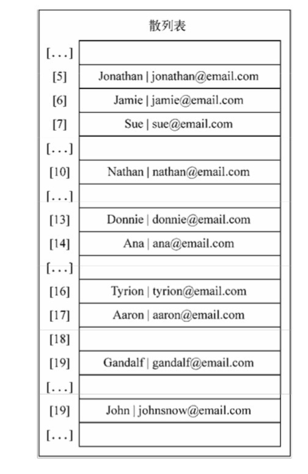

代码

```js
function HashMap(){
    let table = [];

    var loseloseHashCode = function (key) {
        let hash = "";
        for(let i=0; i<key.length;i++){
            hash += key.charCodeAt(i);
        }
        return hash%37;
    }

    var ValuePair = function(key, value){
        this.key = key;
        this.value = value;
        this.toString = function(){
            return "["+this.key+"-"+this.value+"]"
        }
    }

    this.put = function(key,value){
        let position = loseloseHashCode(key);
        if(table[position]===undefined){
            table[position] = new ValuePair(key,value);
        }else{
            let index = ++ position;
            while(table[index]!==undefined){
                index ++;
            }
            table[index] = new ValuePair(key,value);
        }
    }

    this.get = function(key){
        let position = loseloseHashCode(key);
        if(table[position]){
            if(table[position].key==key){
                return table[position].value;
            }else{
                let index = ++position;

                while(table[index]==undefined||table[index]['key']!==key){
                    index++
                }

                if(table[index]['key']==key){
                    return table[index].value;
                }

            }
        }
        return undefined
    }

    this.remove = function(key){
        let position = loseloseHashCode(key);
        if(table[position]){
            if(table[position].key==key){
                return table[position]=undefined;
            }else{
                let index = ++position;
                while(table[index]==undefined||table[index]['key']!==key){
                    index++;
                }
                if(table[index]['key']==key){
                    return table[index] = undefined;
                }

            }
        }
        return false
    }
}

```
## ```创建更好的散列函数```

我们实现的“lose lose”散列函数并不是一个表现良好的散列函数，因为它会产生太多的冲 突。如果我们使用这个函数的话，会产生各种各样的冲突。一个表现良好的散列函数是由几个方 面构成的:插入和检索元素的时间(即性能)，当然也包括较低的冲突可能性。我们可以在网上 找到一些不同的实现方法，或者也可以实现自己的散列函数。


```js
 var djb2HashCode = function (key) {
        var hash = 5381; //{1}
        for (var i = 0; i < key.length; i++) { //{2}
            hash = hash * 33 + key.charCodeAt(i); //{3}
        }
        return hash % 1013; //{4}
    };

```

它包括初始化一个hash变量并赋值为一个质数(行{1}——大多数实现都使用5381)，然后 迭代参数key(行{2})，将hash与33相乘(用来当作一个魔力数)，并和当前迭代到的字符的ASCII 码值相加(行{3})。

最后，我们将使用相加的和与另一个随机质数(比我们认为的散列表的大小要大——在本例中，我们认为散列表的大小为1000)相除的余数。

# 树
树是一种分层数据的抽象模型。现实生活中最常见的树的例子是家谱，或是公司的组织架构 图，如下图所示:


#### ```树的相关术语```
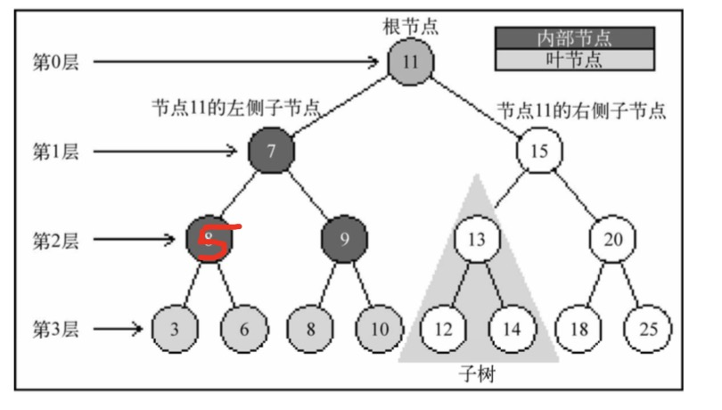

|术语|解释|
|-|-|
|根节点|位于树顶部的节点
|节点  | 树中的每个节点 
|内部节点| 至少有一个子节点 <br/>(7、5、9、15、13和20是内部 节点)
|外部节点| 没有子元素的节点 <br/>(3、6、8、10、12、14、18和25是叶节点)
|子树|子树由节点和它的后代构成<br/>例如，节点13、12和14构成了上 图中树的一棵子树。
|深度|节点的深度取决于它的祖先节点的数量<br/>比如，节点3有3个祖先节 点(5、7和11)，它的深度为3。
|高度|树的高度取决于所有节点深度的最大值。一棵树也可以被分解成层级。根节点在第0层，它 的子节点在第1层，以此类推。上图中的树的高度为3(最大高度已在图中表示——第3层)。

### ```二叉树和二叉搜索树```

二叉树中的节点最多只能有两个子节点:一个是左侧子节点，另一个是右侧子节点。这些定 义有助于我们写出更高效的向/从树中插入、查找和删除节点的算法。二叉树在计算机科学中的 应用非常广泛。
二叉搜索树(BST)是二叉树的一种，但是它只允许你在左侧节点存储(比父节点)小的值， 在右侧节点存储(比父节点)大(或者等于)的值。上一节的图中就展现了一棵二叉搜索树

##### 创建BinarySearchTree类
下图展现了二叉搜索树数据结构的组织方式

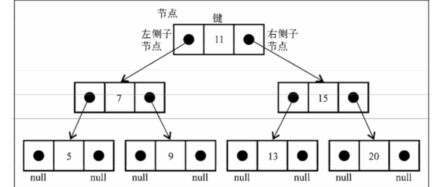
和链表一样，将通过指针来表示节点之间的关系(术语称其为边)。在双向链表中，每个节 点包含两个指针，一个指向下一个节点，另一个指向上一个节点。对于树，使用同样的方式(也 使用两个指针)。但是，一个指向左侧子节点，另一个指向右侧子节点。因此，将声明一个Node 类来表示树中的每个节点(行{1})。值得注意的一个小细节是，不同于在之前的章节中将节点 本身称作节点或项，我们将会称其为键。键是树相关的术语中对节点的称呼。


```代码实现```

```js
 function BinarySearchTree(){

    let Node = function(key){
        this.key = key;
        this.left = null;
        this.right = null;
    }

    let root = null;

    this.insert = function(key){
        let newNode = new Node(key);
        if( root == null ){
            root = newNode;
        }else{
            insertNode(root,newNode);
        }
    }
    //添加节点
    function insertNode(node,newNode){
        if( newNode.key < node.key ){
            if(node.left===null){
                node.left = newNode;
            }else{
                insertNode( node.left,newNode );
            }
        }else{
            if( node.right === null ){
                node.right = newNode;
            }else{
                insertNode( node.right,newNode );
            }
        }
    }   
    //中序遍历
    this.inOrderTraverse = function(callback){
        inOrderTraverseNode(root, callback); //{1}
    };

    function inOrderTraverseNode(node,callback){
        if(node!==null){
            inOrderTraverseNode(node.left,callback);
            callback(node);
            inOrderTraverseNode(node.right,callback)
        }
    }
    
    this.getTree = function(){
        return root;
    }

    }

    var tree = new BinarySearchTree();
    tree.insert(11);
    tree.insert(7);
    tree.insert(15);
    tree.insert(5);
    tree.insert(3);
    tree.insert(9);
    tree.insert(8);
    tree.insert(10);
    tree.insert(13);
    tree.insert(12);
    tree.insert(14);
    tree.insert(20);
    tree.insert(18);
    tree.insert(25);
    tree.insert(6);
    
    function printNode(node){
        console.log(node)
    }
    tree.inOrderTraverse(printNode);
```

以上代码构建的二叉搜索树如下

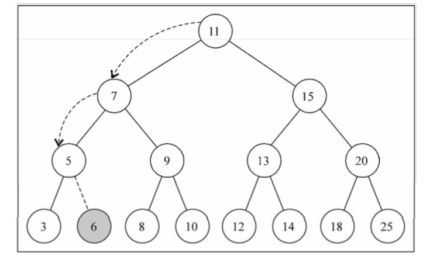

### ```中序遍历的结果如下```
1.先把left推进栈 2.执行自己 3.把right推进栈
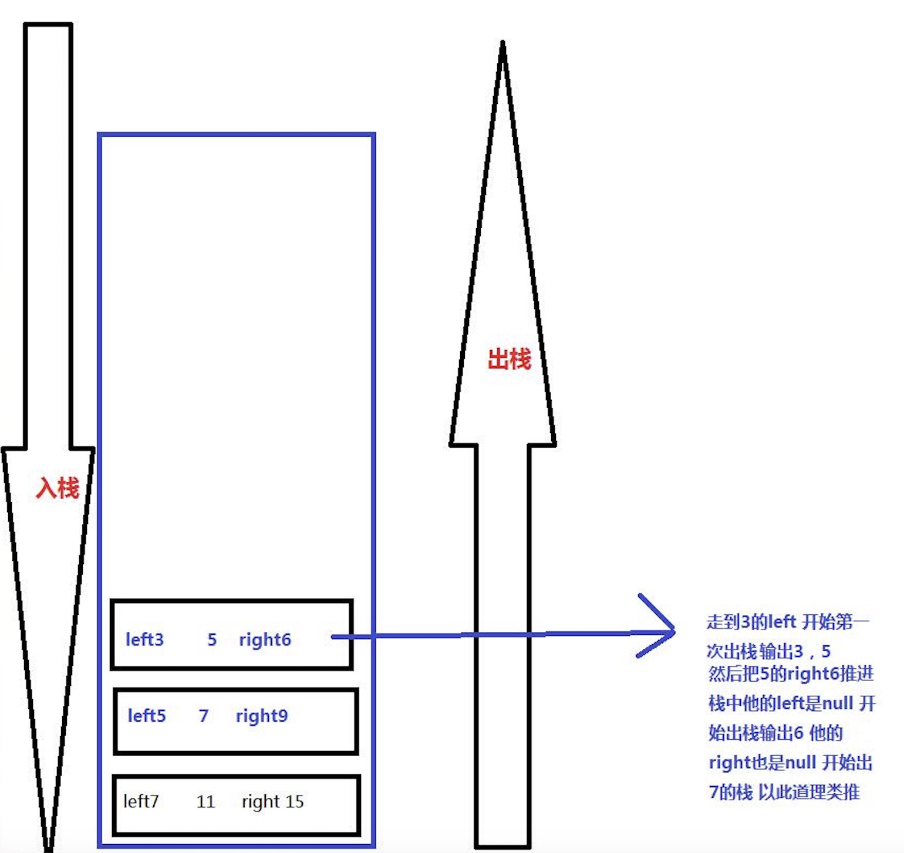
```所以输出 3 5 6 7 8 9 10 11 12 13 14 15 18 20 25```

下面的图描绘了inOrderTraverse方法的访问路径:

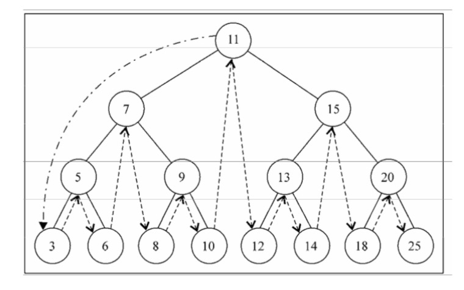

### ```先序遍历```

先序遍历是以优先于后代节点的顺序访问每个节点的。先序遍历的一种应用是打印一个结构化的文档。

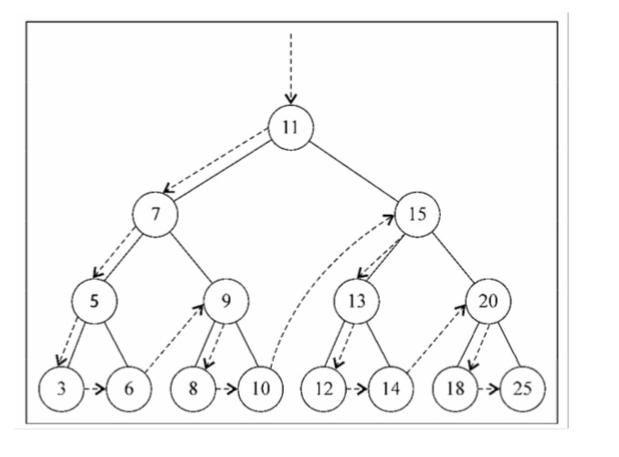<br/>
> 1.先执行自己 
2.把left推进栈
3.把right推进栈


代码

```js
this.preOrderTraverse = function(callback){
    preOrderTraverseNode(root, callback);
};

function preOrderTraverseNode(node,callback){
    if(node!==null){
        callback(node);
        preOrderTraverseNode(node.left,callback);
        preOrderTraverseNode(node.right,callback);
    }
}
```
下面是控制台上的输出结果(每个数字将会输出在不同的行):
11 7 5 3 6 9 8 10 15 13 12 14 20 18 25  9
### ```后序遍历```

后序遍历则是先访问节点的后代节点，再访问节点本身。后序遍历的一种应用是计算一个目录和它的子目录中所有文件所占空间的大小。

> 1.先把left推进栈
2.把right推进栈 
3.执行自己


```js
this.postOrderTraverse = function(callback){
        postOrderTraverseNode(root, callback);
};
var postOrderTraverseNode = function (node, callback) {
    debugger;
    if (node !== null) {
        postOrderTraverseNode(node.left, callback);  
        postOrderTraverseNode(node.right, callback); 
        callback(node.key); 
    } 
}
```

下面是控制台的输出结果(每个数字将会输出在不同行):
3 6 5 8 10 9 7 12 14 13 18 25 20 15 11


### ```搜索最小值和最大值```
根据BST的定义和下图可以看出 最小值是最左边的值 对大值是最右边的值
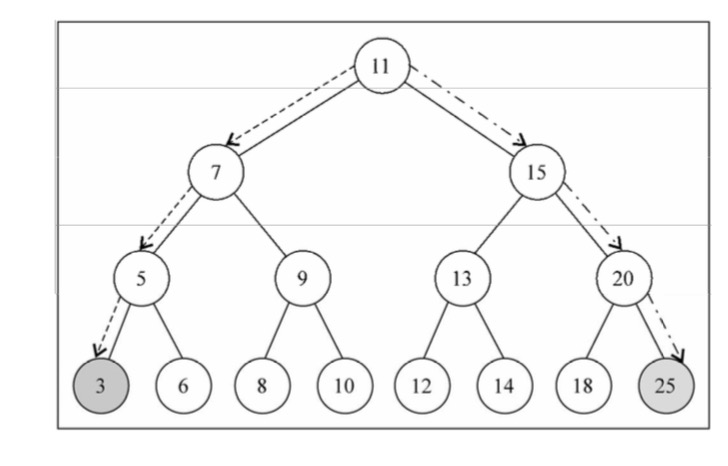

代码
```js
// 最小值
this.min = function() {
    return minNode(root); //{1}
};
var minNode = function (node) {
        if (node){
            while (node && node.left !== null) { //{2}
             node = node.left;
        return node.key;
    }
    return null;  //{4}
};
//最大值
this.max = function() {
        return maxNode(root);
};
var maxNode = function (node) {
    if (node){
        while (node && node.right !== null) { //{5}
                node = node.right;
        }
        return node.key;
    }
    return null;
};
```

### ```搜索一个特定的值```

```js

this.search = function(key){
    return searchNode(root, key); 
};

var searchNode = function(node, key){
    if (node === null){
        return false;
    }
    if (key < node.key){ 
        return searchNode(node.left, key); 
    } else if (key > node.key){
        return searchNode(node.right, key);
    } else {
        return true; 
    }
}

```

###  ```移除一个节点```

第一种情况是该节点是一个没有左侧或右侧子节点的叶节点

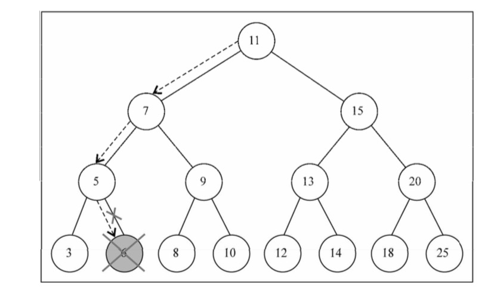

第一种情况是移除有一个左侧或右侧子节点的节点
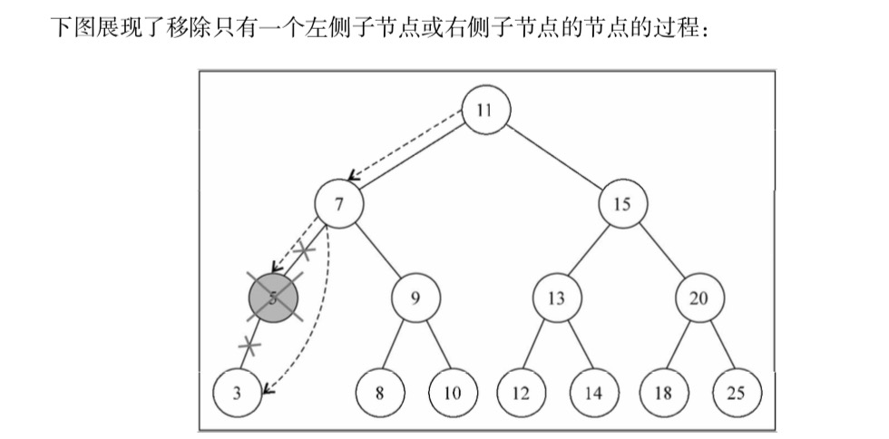

现在是第三种情况，也是最复杂的情况，那就是要移除的节点有两个子节点
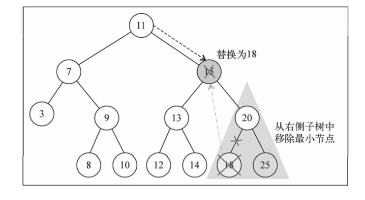

### ```二叉搜索树 完整代码```
BinarySearchTree
|方法名|解释|
|-|-|
insert(key)|添加一个节点
inOrderTraverse(callback)|中序遍历
postOrderTraverse(callback)|后序遍历
preOrderTraverse(callback)|先序遍历
getTree|获取当前树对象
min|获取最小值
max|获取最大值
search(key)|查找节点
remove(key)|删除节点
```js
function BinarySearchTree(){

        let that = this;

        let Node = function(key){
            this.key = key;
            this.left = null;
            this.right = null;
        }

        let root = null;
        // 添加一个节点
        this.insert = function(key){
            let newNode = new Node(key);
            if( root == null ){
                root = newNode;
            }else{
                insertNode(root,newNode);
            }
        }
        
        function insertNode(node,newNode){
            if( newNode.key < node.key ){
                if(node.left===null){
                    node.left = newNode;
                }else{
                    insertNode( node.left,newNode );
                }
            }else{
                if( node.right === null ){
                    node.right = newNode;
                }else{
                    insertNode( node.right,newNode );
                }
            }
        }   
        // 中序遍历
        this.inOrderTraverse = function(callback){
            inOrderTraverseNode(root, callback);
        };

        function inOrderTraverseNode(node,callback){
            if(node!==null){
                inOrderTraverseNode(node.left,callback);
                callback(node);
                inOrderTraverseNode(node.right,callback)
            }
        }
            
        this.getTree = function(){
            return root;
        }
        //先序遍历
        this.preOrderTraverse = function(callback){
            preOrderTraverseNode(root, callback);
        };

        function preOrderTraverseNode(node,callback){
            debugger;
            if(node!==null){
                callback(node);
                preOrderTraverseNode(node.left,callback);
                preOrderTraverseNode(node.right,callback);
            }
        }
        // 后序遍历
        this.postOrderTraverse = function(callback){
                postOrderTraverseNode(root, callback);
        };

        var postOrderTraverseNode = function (node, callback) {
            debugger;
            if (node !== null) {
                postOrderTraverseNode(node.left, callback);  
                postOrderTraverseNode(node.right, callback); 
                callback(node.key); 
            } 
        }
        //最小值
        this.min = function (){
            return minNode(root); 
        };
        //最大值
        this.max = function() {
            return maxNode(root); 
        };
        
        function findMinNode(node){
            return that.search(minNode(node)); 
        }

        function minNode(node){
            if(node){
                while(node && node.left !== null){
                    node = node.left
                } 
                return node.key;
            }
            return null;
        }

        function maxNode(node){
            if(node){
                while(node&&node.right){
                    node = node.right;
                }
                return node.key;
            }
            return null;
        }
        // 查询节点
        this.search = function(key){
            return searchNode(root, key);
        }

        function searchNode(node,key){
            if(node===null){
                return false;
            }
            if(key<node.key){
                return searchNode(node.left,key)
            }else if(key>node.key){
                return searchNode(node.right,key)
            }else{
                return node;
            }
        }
        //删除
        this.remove = function(key){
            root = removeNode(root, key); 
        };
        var removeNode = function(node, key){
            if (node === null){ 
                return null;
            }
            if (key < node.key){ 
                node.left = removeNode(node.left, key); 
                return node; 
            } else if (key > node.key){ 
                node.right = removeNode(node.right, key); 
                return node; 
            } else { 
                //键等于node.key
                //第一种情况——一个叶节点
                if (node.left === null && node.right === null){ 
                    node = null; 
                    return node; 
                }
                //第二种情况——一个只有一个子节点的节点 
                if (node.left === null){ 
                    node = node.right; 
                    return node; 
                } else if (node.right === null){ 
                    return node; 
                }
                //第三种情况——一个有两个子节点的节点 7
                debugger; 
                var aux = findMinNode(node.right); 
                node.key = aux.key; 
                node.right = removeNode(node.right, aux.key); 
                return node; 
            }
        };
    }

    var tree = new BinarySearchTree();
    tree.insert(11);
    tree.insert(7);
    tree.insert(15);
    tree.insert(5);
    tree.insert(3);
    tree.insert(9);
    tree.insert(8);
    tree.insert(10);
    tree.insert(13);
    tree.insert(12);
    tree.insert(14);
    tree.insert(20);
    tree.insert(18);
    tree.insert(25);
    tree.insert(6);
    
    function printNode(node){
        console.log(node)
    }
    //tree.inOrderTraverse(printNode);
    //tree.preOrderTraverse(printNode);
    // tree.postOrderTraverse(printNode);
    console.log(tree.remove(15));
    console.log(tree.getTree());
```

# 图  

> * 邻接表  创建（队列+字典）

图是网络结构的抽象模型。图是一组由边连接的节点(或顶点)。学习图是重要的，因为任
何二元关系都可以用图来表示。
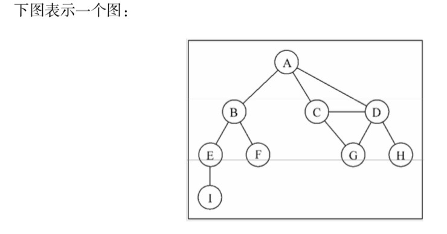
在着手实现算法之前，让我们先了解一下图的一些术语。
|术语|解释|
|-|-|
相邻顶点|由一条边连接在一起的顶点称为相邻顶点。
度|一个顶点的度是其相邻顶点的数量
路径|路径是顶点v1, v2,...,vk的一个连续序列
环|环也是一个简单路径，比如A D C A(最后一个顶点重新回到A)。

##### 有向图和无向图
图可以是无向的(边没有方向)或是有向的(有向图)。如下图所示，有向图的边有一个方向
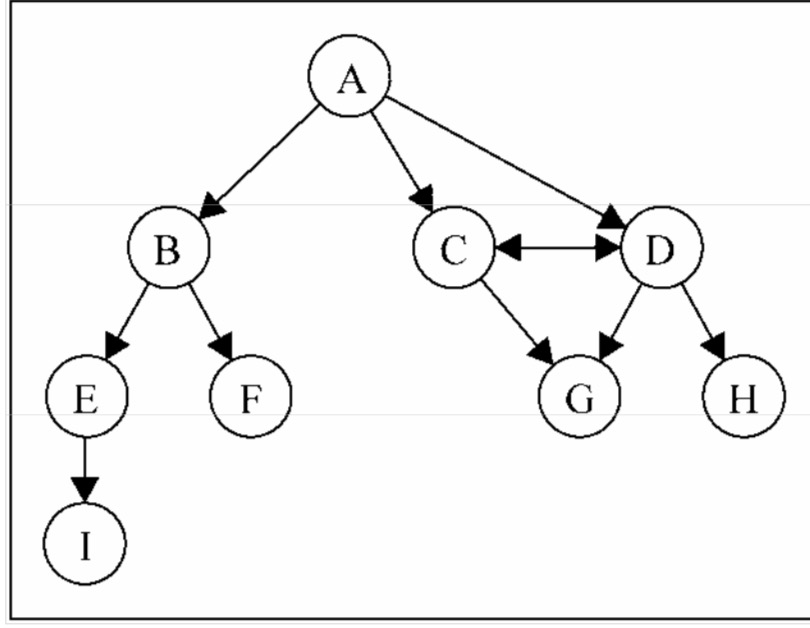
如果图中每两个顶点间在双向上都存在路径，则该图是强连通的。例如，C和D是强连通的，
而A和B不是强连通的。
图还可以是未加权的(目前为止我们看到的图都是未加权的)或是加权的。如下图所示，加
权图的边被赋予了权值:
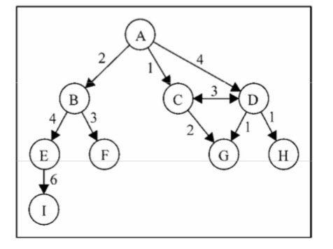
##### 邻接矩阵
图最常见的实现是邻接矩阵。每个节点都和一个整数相关联，该整数将作为数组的索引。我 们用一个二维数组来表示顶点之间的连接。如果索引为i的节点和索引为j的节点相邻，则array[i][j] === 1，否则array[i][j] === 0，如下图所示
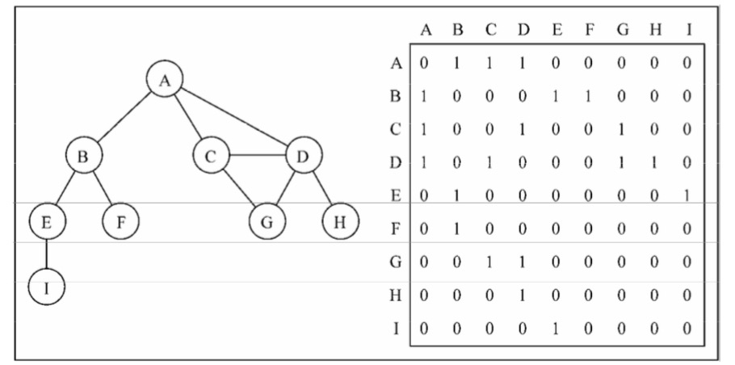
不是强连通的图(稀疏图)如果用邻接矩阵来表示，则矩阵中将会有很多0，这意味着我们 浪费了计算机存储空间来表示根本不存在的边。例如，找给定顶点的相邻顶点，即使该顶点只有 一个相邻顶点，我们也不得不迭代一整行。邻接矩阵表示法不够好的另一个理由是，图中顶点的 数量可能会改变，而2维数组不太灵活
##### 关联矩阵
我们还可以用关联矩阵来表示图。在关联矩阵中，矩阵的行表示顶点，列表示边。如下图所 示，我们使用二维数组来表示两者之间的连通性，如果顶点v是边e的入射点，则array[v][e] === 1; 否则，array[v][e] === 0
```关联矩阵通常用于边的数量比顶点多的情况下,以节省空间和内存。```
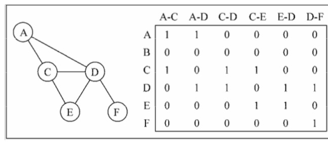
#### 邻接表 
我们也可以使用一种叫作邻接表的动态数据结构来表示图。邻接表由图中每个顶点的相邻顶 点列表所组成。存在好几种方式来表示这种数据结构。我们可以用列表(数组)、链表，甚至是 散列表或是字典来表示相邻顶点列表。下面的示意图展示了邻接表数据结构。
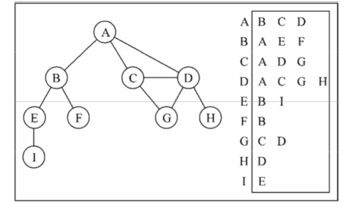
尽管邻接表可能对大多数问题来说都是更好的选择，但以上两种表示法都很有用，且它们有 着不同的性质(例如，要找出顶点v和w是否相邻，使用邻接矩阵会比较快)。我们将会使用邻接表表示法

下面代码实现我们的图
我们的Graph它包括
|方法名|解释|
|-|-|
addVertex| 向图中添加一个新的顶点
addEdge|描边
toString|展现图
bfs|广搜基础实现
BFS|使用BFS寻找最短路径
dfs|深搜  

```js
    function Queue(){

        let items = [];

        this.enqueue = function(element){
            items.push(element);
        };

        this.dequeue = function(){
            return items.shift();
        }

        this.front = function(){
            return items[0];
        }

        this.isEmpty = function(){
            return items.length===0;
        }

        this.clear = function(){
            items.length = 0;
        }

        this.size = function(){
            return items.length;
        }

        this.print = function(){
            console.log(items.toString());
        }
    }

    function Dictionary(){

        let items = {};

        this.has = function(key){
            return key in items;
        };

        this.get = function(key){
            return this.has(key)?items[key]:undefined;
        };

        this.set = function(key,value){
            items[key] = value;
        }

        this.remove = function(key){
            if(this.has(key)){
                delete items[key];
                return true;
            }
            return false;
        }

        this.values = function(){
            let result = [];
            for(let key in items){
                if (this.has(key)) {
                    result.push(items[key])
                }
            }
            return result;
        }

        this.getItems = function(){
            return items;
        }
    }
    function Stack() {
        var items = [];
        this.push = function(element){
            items.push(element);
        };
        this.pop = function(){
            return items.pop();
        };
        this.peek = function(){
            return items[items.length-1];
        };
        this.isEmpty = function(){
            return items.length == 0;
        };
        this.size = function(){
            return items.length;
        };
        this.clear = function(){
            items = [];
        };
        this.print = function(){
            console.log(items.toString());
        }
    }
    function Graph() {

        var vertices = []; 
        var adjList = new Dictionary(); 
        // 向图中添加一个新的顶点
        this.addVertex = function(v){
            vertices.push(v); 
            adjList.set(v, []);
        };
        // 描边
        this.addEdge = function(v, w){
            adjList.get(v).push(w); 
            adjList.get(w).push(v); 
        }
        // 展现图
        this.toString = function(){
            let str = "";
            let length = vertices.length;
            for(let i=0;i<length;i++){
                let key = vertices[i];
                str+=`${key}->${adjList.get(key).join(' ')}\n`
            }
            return str;
        }

        var initializeColor = function(){
             var color = [];
            for (var i=0; i< vertices.length; i++){
                color[vertices[i]] = 'white';
            }
            return color;
        }
        // 版本1 会访问所有与其距离为1的顶点，接着是距离为2的顶点
        this.bfs = function(v, callback){
            // debugger;
            var color = initializeColor(),
            queue = new Queue();
            queue.enqueue(v); //A 
            while (!queue.isEmpty()){
               var u = queue.dequeue(),
               neighbors = adjList.get(u); 
               color[u] = 'grey';              
               for(var i=0; i<neighbors.length; i++){
                    var w = neighbors[i];
                    if (color[w] === 'white'){
                        color[w] = 'grey'; 
                        queue.enqueue(w);
                    } 
                }
                color[u] = 'black'; 
                if (callback) {     
                    callback(u);
                }
            }
        }
        // 使用BFS寻找最短路径
        this.BFS = function(v){
            var color = initializeColor(),
            step=[],
            pred=[],
            queue = new Queue();
            queue.enqueue(v);
            let vlength = vertices.length;
            for(let i=0;i<vlength;i++){
                step[vertices[i]]=0;
                pred[vertices[i]] = null;
            }
            while (!queue.isEmpty()){
               var current = queue.dequeue(),
               neighbors = adjList.get(current); 
               color[current] = 'grey';      
               for(var i=0; i<neighbors.length; i++){
                    var child = neighbors[i];

                    // 我们看下 A->I 的过程 要经过A->B->E->I
                    // 首先 neighbors 等于A的队列[ B C D ]的时候 step.B = step.A+1 = 1;
                    // 等来了B的队列[ A ,E ,F]的时候  step.E = step.B+1 = 2;
                    // 最后到了E的队列[  B , I ]的时候  step.I = step.E+1 = 3;

                    if(color[child] === 'white'){
                        color[child] = 'grey'; 
                        step[child] = step[current] + 1; 
                        pred[child] = current;
                        queue.enqueue(child);
                    } 
                }
                color[current] = 'black'; 
            }
            return {
                distances: step, // 从顶点到其他点的步数
                predecessors: pred  // 前溯点，也就是该点的上一个点
            }
        }
        //深搜  
        this.dfs = function(callback){
            var color = initializeColor();
            for (var i=0; i<vertices.length; i++){ 
                if (color[vertices[i]] === 'white'){ 
                    dfsVisit(vertices[i], color, callback);
                }
            } 
        };

        var dfsVisit = function(current, color, callback){
            color[current] = 'grey'; 
            if (callback) { 
                callback(current);
            }
            var neighbors = adjList.get(current);
            for (var i=0; i<neighbors.length; i++){
                var child = neighbors[i];
                if(color[child] === 'white'){
                    dfsVisit(child, color, callback);
                } 
            }
            color[current] = 'black';
        };
        
    }


    var graph = new Graph();

    var myVertices = ['A','B','C','D','E','F','G','H','I'];

    for (var i=0; i<myVertices.length; i++){ 
        graph.addVertex(myVertices[i]);
    }

    graph.addEdge('A', 'B'); 
    graph.addEdge('A', 'C');
    graph.addEdge('A', 'D');
    graph.addEdge('C', 'D');
    graph.addEdge('C', 'G');
    graph.addEdge('D', 'G');
    graph.addEdge('D', 'H');
    graph.addEdge('B', 'E');
    graph.addEdge('B', 'F');
    graph.addEdge('E', 'I');

    // console.log(graph.toString());

    // function printNode(value){
    //     console.log('Visited vertex: ' + value); 
    // }
    // graph.bfs(myVertices[4], printNode);

    var shortestPathA = graph.BFS(myVertices[0]);
    console.log(shortestPathA);

     /*  通过前溯点数组，我们可以构建从顶点A到其他顶点的路径  */
    // 拿到第一个顶点
    var fromVertex = myVertices[0]; 
    // 遍历所有的点
    for (var i=1; i<myVertices.length; i++){ 
        //拿到第二个点
        var toVertex = myVertices[i],
        //创建栈 存储路径值
        path = new Stack(); 
        //接着，追溯toVertex到fromVertex的路径
        for (var v=toVertex; v!== fromVertex;v=shortestPathA.predecessors[v]) { 
            // 将变量v 也就是从远到近的顶点依次添加到栈中
            path.push(v);
        }
        // 将变量v(起点)添加到栈中
        path.push(fromVertex);
        var s = path.pop();
        while (!path.isEmpty()){
            s += ' - ' + path.pop();
            console.log(s);
        }
    }
    // 最终的s就是从起始点到其他顶点的最短路径
```